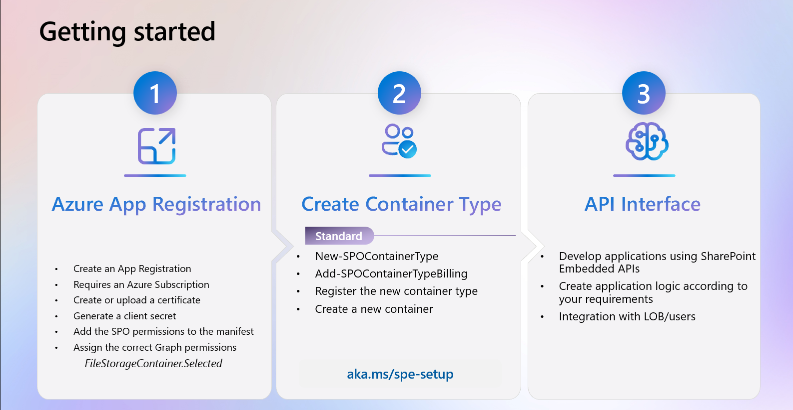

# SPE-Setup

The scripts that I use in this guide can be found in the \assets directory.  A companion video is also available.

Here is an overview of the creation process



1. Creat the Azure App Registration
2. Modify the App Manifest in include this block, replacing what starts on line 72.

``` 
      {
        "id": "4d114b1a-3649-4764-9dfb-be1e236ff371",
        "type": "Scope"
      },
      {
        "id": "19766c1b-905b-43af-8756-06526ab42875",
        "type": "Role"
      }
    ]
  },
  {
    "resourceAppId": "00000003-0000-0000-c000-000000000000",
    "resourceAccess": [
      {
        "id": "085ca537-6565-41c2-aca7-db852babc212",
        "type": "Scope"
      },
      {
        "id": "40dc41bc-0f7e-42ff-89bd-d9516947e474",
        "type": "Role"
      },
      {
            "id": "e1fe6dd8-ba31-4d61-89e7-88639da4683d",
            "type": "Scope"
        }
    ]
  }
],
```

3. Set the variables we need to run the setup scripts

```
$TenantName = "<TenantName>"
$TenantID = "<TenantID>"
$AppId = "<AppID>"
$ClientSecret = "<ClientSecret>"
$ContainerTypeName = "ContainerName"
$ContainerName = "SPEVideoDemoContainer"
$ContainerTypeId = "<ContainerTypeID>"
$AzureSubscriptionId = "<AzureSubscriptionID>"
$ResourceGroup = "<ResourceGroup>"
$CertPath = "./certs/SPDemo.key"
$Thumbprint = "Thumbprint"
$AdminUser = "<user>"

```

4. Create a new certificate if you don't already have one.  Upload it to the App Registration.

```
 .\createCert.ps1 -CertName $ContainerName

```

5. Create the container type.

```
Import-Module "Microsoft.Online.SharePoint.PowerShell"
Import-Module Microsoft.Online.SharePoint.PowerShell -UseWindowsPowerShell
Connect-SPOService -Url "https://${TenantName}-admin.sharepoint.com"

New-SPOContainerType -ContainerTypeName $ContainerTypeName -OwningApplicationId $AppId

$ContainerTypeId = "<ContainerTypeId>"
```

6. Update the ContainerTypeId variable with the PowerShell output.
7. Associate the Azure Subscription to the newly created Container Type

```
Add-SPOContainerTypeBilling –ContainerTypeId $ContainerTypeId -AzureSubscriptionId $AzureSubscriptionId -ResourceGroup $ResourceGroup -Region "eastus"

```

8. Register the Container Type and create a new Container.

```
.\SPERegistrationScript.ps1 -ClientId $AppId -ContainerTypeId $ContainerTypeId -PemCertificationFilePath $CertPath -ConsumerTenantId $TenantID -ConsumerTenantUrl "https://${TenantName}.sharepoint.com" -Thumbprint $Thumbprint
.\CreateContainer.ps1 -TenantId $TenantID -ClientId $AppId -ClientSecret $ClientSecret -ContainerTypeId $ContainerTypeId -DisplayName "Container1" -UserPrincipalName "${AdminUser}@${TenantName}.onmicrosoft.com" -Role "owner"

```

9. You will now be able to see the newly created Container Type and container in the SharePoint Admin center.  It may take up to 5 minutes to appear.
10. Everything is now configured for you to use SharePoint Embedded in your application.
